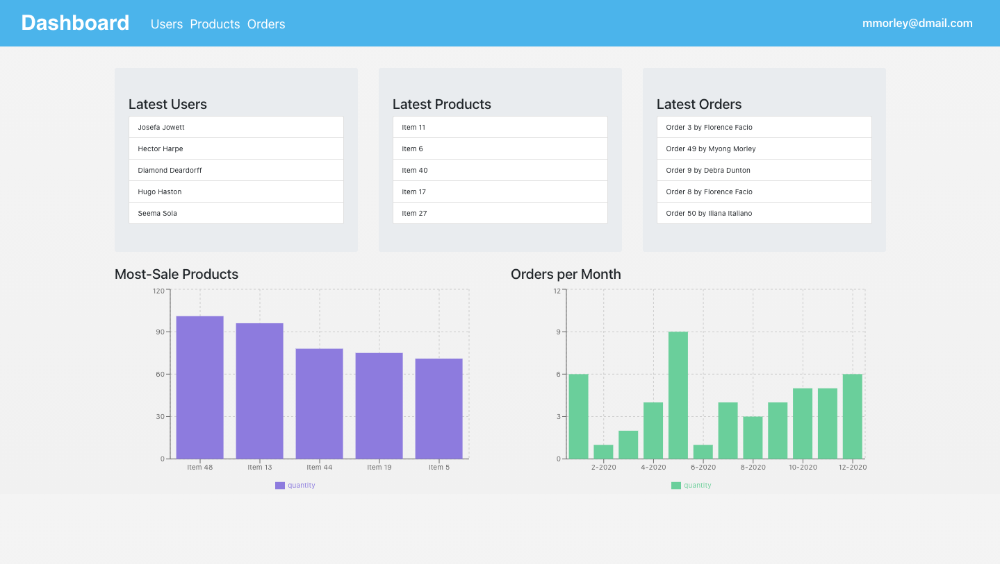

# Orders and products

> An application to report orders made by a user. This app has four modules to show the information: dashboard, users, products, and orders.

    

API requested:
- Live: [https://product-orders-api.herokuapp.com/](https://product-orders-api.herokuapp.com/)
- Repo: [https://github.com/fivan18/api-user-product-order](https://github.com/fivan18/api-user-product-order)

## Built With

- [create-react-app](https://create-react-app.dev/)
- [React](https://reactjs.org/)
- [Redux](https://redux.js.org/)

## Live Demo

[https://products-orders-front.herokuapp.com/](https://products-orders-front.herokuapp.com/)

## Getting Started

To get a local copy up and running follow these simple example steps.

### Prerequisites

Make sure you have installed [Node JS](https://nodejs.org/en/). If not, follow this [guide](https://www.geeksforgeeks.org/installation-of-node-js-on-linux/) for Linux or this [one](https://treehouse.github.io/installation-guides/mac/node-mac.html) for Mac OS.

### Setup

Download the project

    $ git clone https://github.com/fivan18/products-orders-front.git

Install the dependencies

    $ npm install

### Install

To modify the code and see the changes on live go to the project's root directory and run:

    $ npm start

### Usage

Open the next link [http://localhost:3000/](http://localhost:3000/).

### Deployment

To deploy this project on heroku follow the next [instructions](https://github.com/mars/create-react-app-buildpack).

## Authors

👤 **Ivan Ulises Guzman Sanchez**

- Github: [@fivan18](https://github.com/fivan18)
- Twitter: [@fivanunam](https://twitter.com/fivanunam)
- Linkedin: [fivan](https://www.linkedin.com/in/fivan)

## Contributing

Contributions, issues and feature requests are welcome!

Feel free to check the [issues page](https://github.com/fivan18/products-orders-front/issues).

## Show your support

Give a ⭐️ if you like this project!
